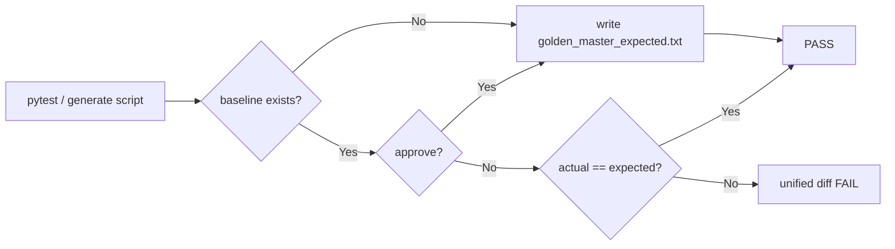

# MagicSquare_xx — Golden Master Regression Testing Report

| 항목 | 내용 |
|------|------|
| 프로젝트 | MagicSquare_xx |
| 문서 ID | RPT-12 |
| 단계 | **Golden Master (Approval) 회귀 안전장치 구축** |
| 범위 | 솔버 출력 기준 파일·approve 패턴·GM-TC-01~05 회귀 테스트 |
| 기준 문서 | [Report/06.PRD_MagicSquare_xx.md](./06.PRD_MagicSquare_xx.md) §9.3~9.4, [Report/05](./05.InvariantsBased_TDD_UserJourney_Stories_Scenarios_Report.md) SC-DOM-SOL-001 |
| 선행 산출 | [Report/11.PyQt_GUI_Implementation_Report.md](./11.PyQt_GUI_Implementation_Report.md) — Domain 솔버·GUI MVP |
| Transcript | [12.Golden_Master_Regression_Testing-Prompt.md](../Prompt/12.Golden_Master_Regression_Testing-Prompt.md) |
| 설계 상세 | [docs/golden_master_approve_pattern.md](../docs/golden_master_approve_pattern.md) |
| 작성일 | 2026-05-29 |

---

## 1. Executive Summary

본 스프린트는 Report/11 GUI·Domain 솔버 구현 이후 **REFACTOR 전 회귀 안전장치**로 Golden Master(Approval) 테스트 체계를 구축했다. `ScreenBoundary.submit()` → `resolve()` 파이프라인의 **성공 벡터(`int[6]`)** 와 **실패 코드(`FailureResult.code`)** 를 고정 입력 시나리오(GM-TC-01~05)로 스냅샷 비교하며, 불일치 시 unified diff 후 FAIL한다.

| 성과 | 산출물 / 상태 |
|------|----------------|
| 기준 파일 | `tests/golden_master_expected.txt` — GM-TC-01~05 섹션 (Git 버전 관리) |
| 지원 모듈 | `tests/golden_master_support.py` — 직렬화·diff·approve·계약 assert |
| 회귀 테스트 | `tests/test_golden_master_magic_square.py` — `@pytest.mark.golden_master` |
| 생성 스크립트 | `scripts/generate_golden_master.py` — bootstrap / compare / `--approve` |
| pytest 마커 | `pytest.ini` — `golden_master` 등록 |
| README 체크리스트 | [README.md](../README.md) § Golden Master 회귀 안전장치 (GM-01~GM-10 ✅) |
| 검증 | `pytest -m golden_master -v` — **9/9 PASS** |
| AC-FR-01-01 회귀 | **25/25 PASS** (Golden Master와 독립 유지) |

---

## 2. 배경·목적

### 2.1 요청

> Magic Square Solver 출력 기반 Golden Master 기준 파일 생성  
> approve 패턴 적용 · GM-TC 시나리오 · REFACTOR 전 회귀 보호

Report/11까지 Domain 솔버와 PyQt GUI가 도입되었으나, **출력 계약·조합 전략·Error Contract** 에 대한 통합 회귀 스냅샷은 없었다. PRD §12 Verification Strategy의 **Regression Protection** 단계에 맞춰, 리팩터링 전에 Golden Master를 고정한다.

### 2.2 설계 원칙

| 원칙 | 적용 |
|------|------|
| Contract-first | API Result DTO 직렬화 (`FailureResult` / `list[int]`) — stdout 비사용 |
| Approve pattern | 기준 없음 → 자동 생성 · 있음 → `open(expected).read()` vs actual |
| 결정성 (M-1) | 동일 입력 → 동일 섹션 문자열 |
| ECB 격리 | Golden Master는 **솔버 경로**만 검증; AC-FR-01-01 size 검증은 별도 테스트 유지 |
| REFACTOR 안전 | row-major · 1-index · small-first · reverse fallback · Error Contract 명시 assert |

---

## 3. 구현 산출물

### 3.1 디렉터리 구조 (신규·변경)

```
MagicSquare_xx/
├── scripts/
│   └── generate_golden_master.py          # 기준 생성·비교·승인 CLI (신규)
├── tests/
│   ├── golden_master_expected.txt         # Golden Master baseline (신규)
│   ├── golden_master_support.py           # 시나리오·직렬화·diff (신규)
│   ├── test_golden_master_magic_square.py # [TAG][GoldenMaster] 테스트 (신규)
│   └── conftest.py                        # --approve-golden fixture (변경)
├── docs/
│   └── golden_master_approve_pattern.md   # approve 패턴 설계 (신규)
├── pytest.ini                             # golden_master 마커 (변경)
└── README.md                              # GM-01~GM-10 체크리스트 (변경)
```

### 3.2 Golden Master 시나리오 (GM-TC-01~05)

| ID | 제목 | 전략 / 오류 | 기대 출력 (DTO) |
|----|------|-------------|-----------------|
| **GM-TC-01** | 정상 조합 성공 | small-first | `[3,3,6,4,3,15]` |
| **GM-TC-02** | reverse 조합 성공 | small-first 실패 → reverse (SC-DOM-SOL-001, G2) | `[3,3,6,4,4,1]` |
| **GM-TC-03** | INVALID_BLANK_COUNT | P-2 위반 (빈칸 3개) | `EMPTY_COUNT_INVALID` |
| **GM-TC-04** | DUPLICATE_NUMBER | P-4 위반 (`7` 중복) | `DUPLICATE_NONZERO` |
| **GM-TC-05** | NO_VALID_MAGIC_SQUARE | G1 — 두 배치 모두 비마방진 | `NO_VALID_COMPLETION` |

> 요구 명칭(`INVALID_BLANK_COUNT`, `NO_VALID_MAGIC_SQUARE`)은 설계 별칭이며, Golden Master 기준 파일에는 **런타임 Error Contract 코드**를 기록한다. 별칭↔런타임 매핑은 `ERROR_CONTRACT_ALIASES` 및 `TestGoldenMasterContractAliases`에서 검증한다.

### 3.3 기준 파일 형식 (`golden_master_expected.txt`)

- 섹션 헤더: `[GM-TC-XX]`
- 입력: `Input:` + 4행 공백 구분 정수
- 성공: `Output:` + `[n1,n2,n3,n4,n5,n6]` (쉼표만, 공백 없음)
- 실패: `Error:` + `{code}` (`message` 제외 — 회귀 노이즈 방지)
- 섹션 구분: `________________________________________`

### 3.4 Approve 패턴



**승인 명령:**

```powershell
pytest -m golden_master --approve-golden -v
python scripts/generate_golden_master.py --approve
$env:GOLDEN_MASTER_APPROVE=1; pytest -m golden_master -v
```

**실패 시 출력 형식:** `--- expected` / `+++ actual` / `@@ line diff @@` (`difflib.unified_diff`)

---

## 4. 회귀 보호 항목 (GM-07~GM-10)

| ID | 보호 대상 | 검증 방식 |
|----|-----------|-----------|
| GM-07 | row-major 빈칸 좌표 | `assert_success_output_contract` — `locate_empty_cells`와 벡터 `(r1,c1,r2,c2)` 일치 |
| GM-08 | 1-index 좌표 | 모든 좌표 `∈ [1,4]` |
| GM-09 | reverse fallback | GM-TC-02 — `strategy="reverse"` 벡터·`is_magic_square` 검증 |
| GM-10 | Error Contract | GM-TC-03~05 — `FailureResult.code` + 별칭 매핑 테스트 3건 |

추가로 GM-TC-01에서 **small-first** 조합 규칙을 명시 검증한다.

---

## 5. 검증 결과

### 5.1 Golden Master 전용

```powershell
pytest -m golden_master -v
```

```text
collected 67 items / 58 deselected / 9 selected

tests/test_golden_master_magic_square.py::TestGoldenMasterMagicSquare::test_golden_master_document_matches_baseline PASSED
tests/test_golden_master_magic_square.py::TestGoldenMasterMagicSquare::test_golden_master_case[GM-TC-01] PASSED
tests/test_golden_master_magic_square.py::TestGoldenMasterMagicSquare::test_golden_master_case[GM-TC-02] PASSED
tests/test_golden_master_magic_square.py::TestGoldenMasterMagicSquare::test_golden_master_case[GM-TC-03] PASSED
tests/test_golden_master_magic_square.py::TestGoldenMasterMagicSquare::test_golden_master_case[GM-TC-04] PASSED
tests/test_golden_master_magic_square.py::TestGoldenMasterMagicSquare::test_golden_master_case[GM-TC-05] PASSED
tests/test_golden_master_magic_square.py::TestGoldenMasterContractAliases::test_error_contract_alias_mapping[...] PASSED (×3)

====================== 9 passed, 58 deselected in 0.05s =======================
```

### 5.2 README 체크리스트 (GM-01~GM-10)

| 그룹 | 항목 | 상태 |
|------|------|------|
| 기준 파일 | GM-01~03 | ✅ |
| 테스트 코드 | GM-04~06 | ✅ |
| 회귀 보호 | GM-07~10 | ✅ |

---

## 6. Traceability

| Requirement / Story | Golden Master | 검증 |
|---------------------|---------------|------|
| MS-US-05 두 조합 시도 | GM-TC-01, GM-TC-02 | small-first / reverse |
| SC-DOM-SOL-001 | GM-TC-02 | `[3,3,6,4,4,1]` |
| P-2 빈칸 2개 | GM-TC-03 | `EMPTY_COUNT_INVALID` |
| P-4 중복 금지 | GM-TC-04 | `DUPLICATE_NONZERO` |
| No solution | GM-TC-05 | `NO_VALID_COMPLETION` |
| O-* Output Contract | GM-TC-01~02 | int[6], 1-index, row-major |
| M-1 결정성 | 전체 문서 compare | 문자열 동일성 |
| PRD §12 Regression Protection | Golden Master suite | `pytest -m golden_master` |

---

## 7. 아키텍처 흐름 (캡처 파이프라인)

```
GOLDEN_MASTER_CASES (grid fixtures)
    │
    ▼
ScreenBoundary.submit(grid)
    │ INVALID_SIZE? → (Golden Master 범위 외 — AC-FR-01-01 별도)
    ▼
control.solve.resolve(grid)
    ▼
entity.solver.solve(grid)
    │ DomainError → FailureResult(code, message)
    ▼
list[int] length 6  OR  FailureResult
    │
    ▼
serialize_result() → golden_master_expected.txt 섹션
    │
    ▼
open(expected).read() vs actual  (+ contract asserts)
```

---

## 8. 제약·리스크

| ID | 항목 | 내용 | 권장 조치 |
|----|------|------|-----------|
| R-01 | message 미포함 | Golden Master는 `FailureResult.code`만 스냅샷 — message 회귀는 별도 테스트 필요 | U-IN / Error Contract golden string 테스트 후속 |
| R-02 | Boundary 선검증 | 빈칸·중복 오류가 Domain까지 진입 (Report/11 R-03 동일) | U-IN-04~08 GREEN 시 Golden Master 시나리오 재검토 |
| R-03 | Approve 남용 | `--approve` 무분별 실행 시 의도치 않은 기준 갱신 | PR 리뷰 시 diff 필수 |
| R-04 | G1 fixture | GM-TC-05가 G1 unsolvable 케이스 사용 — Report/11 G1 분석과 일치 | Domain RED 정합성 유지 |

---

## 9. 다음 단계 (권장)

| # | 작업 | 완료 기준 |
|---|------|-----------|
| 1 | CI에 `pytest -m golden_master` 추가 | PR·main 파이프라인 GREEN |
| 2 | REFACTOR 단계 진입 | Golden Master 9/9 PASS 유지하며 `entity/solver.py` 구조 개선 |
| 3 | Domain RED → GREEN (D-T*) | `tests/entity/test_d_*.py` — Golden Master와 중복 최소화 |
| 4 | U-OUT GREEN | `test_u_out_contract.py` — 출력 계약 이중 보호 |
| 5 | git commit | `test: golden master regression for solver output` 등 |

---

## 10. 참고 문서

- [11.PyQt_GUI_Implementation_Report.md](./11.PyQt_GUI_Implementation_Report.md)
- [05.InvariantsBased_TDD_UserJourney_Stories_Scenarios_Report.md](./05.InvariantsBased_TDD_UserJourney_Stories_Scenarios_Report.md)
- [06.PRD_MagicSquare_xx.md](./06.PRD_MagicSquare_xx.md)
- [docs/golden_master_approve_pattern.md](../docs/golden_master_approve_pattern.md)
- [README.md](../README.md) § Golden Master 회귀 안전장치

---

*본 보고서는 Golden Master 회귀 안전장치 구축 스냅샷(GM-TC-01~05 · approve 패턴 · 9/9 PASS)이다.*
