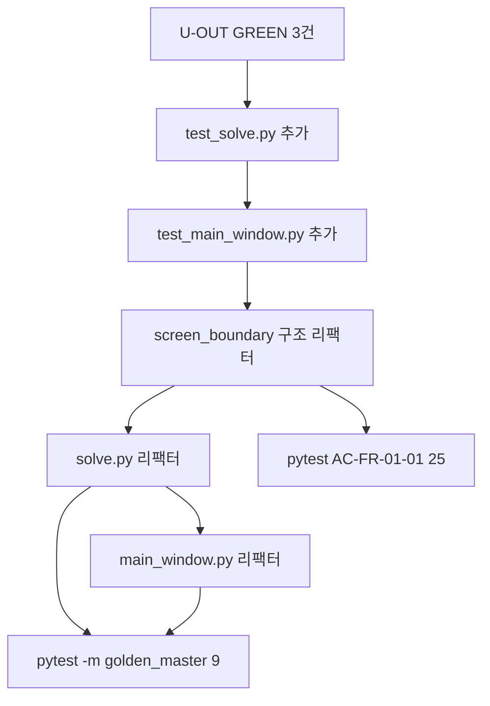

# MagicSquare_xx — REFACTOR Phase Readiness & Checklist Report

| 항목 | 내용 |
|------|------|
| 프로젝트 | MagicSquare_xx |
| 문서 ID | RPT-13 |
| 단계 | **TDD REFACTOR 준비** — 테스트 매핑·체크리스트·코드 리뷰 |
| 범위 | `src/control/*`, `src/boundary/*`, `src/boundary/ui/*` |
| 기준 규칙 | [.cursorrules](../.cursorrules) `refactor_phase` |
| 선행 산출 | [Report/12.Golden_Master_Regression_Testing_Report.md](./12.Golden_Master_Regression_Testing_Report.md) — GM 9/9 PASS |
| Transcript | [13.REFACTOR_Phase_Readiness_and_Checklist-Prompt.md](../Prompt/13.REFACTOR_Phase_Readiness_and_Checklist-Prompt.md) |
| README 반영 | [README.md](../README.md) § TDD REFACTOR 체크리스트 |
| 작성일 | 2026-05-29 |

---

## 1. Executive Summary

본 스프린트는 Golden Master 회귀 안전장치(Report/12) 완료 이후 **REFACTOR 단계 진입 전 준비**를 수행했다. `code-reviewer` 서브에이전트를 통한 전체 코드 리뷰, `control` / `boundary` / `boundary/ui` 레이어의 **테스트 대응·RED 스켈레톤 분류**, `.cursorrules` REFACTOR phase 기준 **착수 조건 정리**를 거쳐 README에 **TDD REFACTOR 체크리스트**를 고정했다.

| 성과 | 상태 |
|------|------|
| 코드 리뷰 (code-reviewer) | ECB·Golden Master 강점·23건 RED·문서 불일치·Bootstrap 리스크 식별 |
| REFACTOR 테스트 매핑 | 8개 소스 파일 ↔ 테스트 파일 대응표 작성 |
| RED 분류 | U-OUT GREEN 전환 3건 · U-FLOW null 1건 · U-IN/U-FLOW E002/E005 GREEN phase 보류 |
| README 체크리스트 | § TDD REFACTOR 체크리스트 — 착수 순서·검증 명령·진행 스냅샷 |
| 검증 (선행 GREEN) | AC-FR-01-01 **25/25 PASS** · Golden Master **9/9 PASS** |

**핵심 결론:** Domain 솔버·통합 경로는 동작하나 **entity RED 23건·boundary U-OUT RED 3건·UI 테스트 0건**으로, REFACTOR는 **U-OUT GREEN + control/UI 단위 테스트 추가** 후 `screen_boundary` / `solve` / `main_window` 구조 개선 순으로 진행하는 것이 `.cursorrules`에 부합한다.

---

## 2. 배경·목적

### 2.1 요청 흐름

1. `/code-reviewer`로 `MagicSquare_xx` 전체 코드 리뷰
2. REFACTOR phase 기준으로 `control` / `boundary` / `ui` 테스트 매핑·RED 분류 질의 (Ask mode)
3. [README.md](../README.md)에 REFACTOR 체크리스트 반영
4. 본 Report·Transcript Export (RPT-13)

### 2.2 REFACTOR phase 정의 (`.cursorrules`)

| 규칙 | 내용 |
|------|------|
| 목적 | 기능 변경 없이 구조만 개선 |
| 필수 | 전체 관련 테스트 GREEN 유지, 커버리지·핵심 경로 검증 유지 |
| 금지 | 외부 동작 변경, 테스트가 못 잡는 변경, 커버리지·테스트 약화 |

**한 줄 원칙:** GREEN 테스트가 없으면 리팩터가 외부 동작을 바꿔도 회귀를 탐지할 수 없다.

---

## 3. 코드 리뷰 요약 (code-reviewer)

### 3.1 Strengths

- ECB 레이어 분리: `entity/solver` ↔ `control/solve` ↔ `boundary/screen_boundary`
- Golden Master: DTO 직렬화, approve 패턴, GM-TC-01~05 + 계약 assert
- AC-FR-01-01 Boundary 테스트 25건 (AAA, mock 격리, 메타 스코프)
- Error Contract: `DomainError` → `FailureResult`, `ERROR_CONTRACT_ALIASES`

### 3.2 주요 이슈 (리팩터 관련)

| Severity | 이슈 | REFACTOR 영향 |
|----------|------|----------------|
| Critical | 전체 pytest 23건 RED (entity 스켈레톤) | entity 리팩터 전 D-* GREEN 또는 마커 분리 필요 |
| Important | U-OUT-01~03 RED (동작은 GM으로 검증됨) | boundary/control 출력 리팩터 전 GREEN 권장 |
| Important | `tests/control/`·`tests/boundary/ui/` 부재 | `solve.py`·`main_window.py` 리팩터 무방비 |
| Important | README·`golden_master_approve_pattern.md` 섹션 ID 불일치 | 문서 REFACTOR (기능 무관) |
| Minor | `GRID_SIZE` 이중 정의, stale docstring, 이중 `submit()` | REFACTOR 4-B·4-A 대상 |

---

## 4. 파일별 테스트 대응 (`control` / `boundary` / `ui`)

| 소스 파일 | 대응 `test_*.py` | GREEN | RED | REFACTOR 전 조치 |
|-----------|------------------|-------|-----|------------------|
| `control/__init__.py` | — | — | — | 불필요 |
| `control/solve.py` | — (GM 간접) | 9* | — | `tests/control/test_solve.py` 신규 |
| `boundary/models.py` | — (간접) | 25+9* | — | 선택 `test_models.py` |
| `boundary/screen_boundary.py` | `test_grid_input_validation_ac_fr_01_01.py` | 25 | 0 | REFACTOR 가능 |
| | `test_u_in_validation.py` | 0 | 5 | GREEN phase (AC-FR-01-02~05) |
| | `test_u_out_contract.py` | 0 | 3 | **GREEN 전환** |
| | `test_u_flow_isolation.py` | 0† | 3 | null† GREEN / E002·E005 보류 |
| | `test_golden_master_magic_square.py` | 9 | 0 | 안전망 유지 |
| `boundary/ui/main_window.py` | — | 0 | — | `tests/boundary/ui/test_main_window.py` 신규 |

\* Golden Master 통합  
† null·size invalid는 AC-FR-01-01에서 `resolve` 0회 이미 검증

---

## 5. RED 스켈레톤 분류

### 5.1 REFACTOR 전 GREEN (동작 존재)

| ID | 파일 | 내용 |
|----|------|------|
| U-OUT-01 | `test_u_out_contract.py` | 성공 시 `len(result)==6` |
| U-OUT-02 | `test_u_out_contract.py` | 좌표 1-index ∈ [1,4] |
| U-OUT-03 | `test_u_out_contract.py` | 성공 시 `list[int]`, not `FailureResult` |
| U-FLOW-02 (null) | `test_u_flow_isolation.py` | `grid=None` → resolve 0회 (AC-FR-01-01 assert 이식) |

### 5.2 신규 테스트 (스켈레톤 없음)

| 대상 | 파일 | 검증 초점 |
|------|------|-----------|
| `control.solve.resolve` | `tests/control/test_solve.py` | `entity.solver.solve` 위임, `DomainError` 전파 |
| `MainWindow._read_grid` | `tests/boundary/ui/test_main_window.py` | `UI_PARSE_ERROR`, `UI_CELL_RANGE`, 빈칸→0 |

### 5.3 GREEN phase 보류 (기능 추가)

| ID | 건수 | 사유 |
|----|------|------|
| U-IN-04~08 | 5 | boundary 선행 검증 미구현 — 현재 domain 경유 |
| U-FLOW-02 E002/E005 | 2 | invalid 시 `resolve` 호출 후 `DomainError` — 설계(Report/10)와 스켈레톤 기대 불일치 |

### 5.4 Entity RED (REFACTOR 범위 외·병행 권장)

`tests/entity/test_d_*.py` — D-VAL/D-SOL/D-LOC/D-MIS **11건 RED**. Domain 리팩터 시 Golden Master(9) + entity 단위 GREEN 병행 권장.

---

## 6. REFACTOR 착수 순서 (권장)



| 단계 | 작업 | 완료 기준 |
|------|------|-----------|
| 1 | U-OUT GREEN (+ U-FLOW null 선택) | `test_u_out_contract.py` 3 passed |
| 2 | `tests/control/test_solve.py` | resolve 위임·예외 전파 locked |
| 3 | `tests/boundary/ui/test_main_window.py` | `_read_grid` 분기 covered |
| 4-A | `solve.py` 리팩터 | GM 9/9 + solve tests GREEN |
| 4-B | `screen_boundary.py` 리팩터 | AC-FR-01-01 25/25 + GM 9/9 |
| 4-C | `main_window.py` 리팩터 | UI tests + GM 9/9 |

**수정 허용 / 금지 (README 동일)**

| 단계 | 허용 | 금지 |
|------|------|------|
| 4-A | 네이밍·위임 구조 | `entity.solver` 규칙 변경 |
| 4-B | 책임 분리·`GRID_SIZE` SSOT | `INVALID_SIZE` 계약 변경 |
| 4-C | UI/파싱 분리 | Error Contract 코드·메시지 변경 |

---

## 7. 검증 결과 (Export 시점)

### 7.1 선행 GREEN (REFACTOR 안전망)

```powershell
python -m pytest tests/boundary/test_grid_input_validation_ac_fr_01_01.py -v
```

```text
25 passed in 0.04s
```

```powershell
python -m pytest -m golden_master -v
```

```text
9 passed, 58 deselected in 0.04s
```

### 7.2 REFACTOR 전 미충족

```powershell
python -m pytest tests/boundary/test_u_out_contract.py -v
```

→ **3 failed** (RED 스켈레톤 `pytest.fail`)

---

## 8. Traceability

| Requirement | 테스트 / 문서 | REFACTOR 역할 |
|-------------|---------------|---------------|
| AC-FR-01-01 INVALID_SIZE | 25 GREEN | `screen_boundary` size 경로 잠금 |
| MS-US-05 Output Contract | U-OUT-01~03 (RED→GREEN 예정) | 성공 `int[6]` 리팩터 잠금 |
| PRD §12 Regression | Golden Master 9 GREEN | 통합 회귀 |
| `.cursorrules` refactor_phase | README REFACTOR 체크리스트 | 진입·금지 규칙 |
| Report/09 U-IN-04~08 | 5 RED | GREEN phase — REFACTOR와 분리 |
| Report/11 GUI | `main_window.py` | UI 단위 테스트 후 리팩터 |

---

## 9. 리스크·제약

| ID | 항목 | 내용 | 권장 |
|----|------|------|------|
| R-01 | U-OUT RED | GM만으로 성공 경로 보호 — 전용 테스트 없음 | 단계 1 GREEN |
| R-02 | UI 무방비 | PyQt headless 부담 | `_read_grid` helper 추출 후 단위 테스트 |
| R-03 | entity 23 RED | `pytest` 전체 실행 실패 | CI 마커 분리 또는 D-* GREEN |
| R-04 | U-IN 혼동 | REFACTOR 중 boundary 선행 검증 추가 시 동작 변경 | AC-FR-01-02~05를 GREEN phase로 분리 |
| R-05 | Bootstrap | GM baseline 누락 시 per-case silent pass | fail-fast (Report/12 R-03 연계) |

---

## 10. 다음 단계

| # | 작업 | 완료 기준 |
|---|------|-----------|
| 1 | U-OUT-01~03 GREEN | 3 passed |
| 2 | `tests/control/test_solve.py` | resolve 단위 GREEN |
| 3 | `tests/boundary/ui/test_main_window.py` | `_read_grid` GREEN |
| 4 | `screen_boundary` REFACTOR | 25 + 9 GM PASS |
| 5 | CI | `boundary` AC-FR-01-01 + `golden_master` 마커 |
| 6 | entity D-* GREEN | Domain 리팩터 안전망 |

---

## 11. 참고 문서

- [12.Golden_Master_Regression_Testing_Report.md](./12.Golden_Master_Regression_Testing_Report.md)
- [10.AC_FR_01_01_GREEN_Testing_and_Implementation_Report.md](./10.AC_FR_01_01_GREEN_Testing_and_Implementation_Report.md)
- [09.DualTrack_RED_Design_and_Skeleton_Report.md](./09.DualTrack_RED_Design_and_Skeleton_Report.md)
- [README.md](../README.md) § TDD REFACTOR 체크리스트
- [.cursorrules](../.cursorrules)

---

*본 보고서는 REFACTOR 단계 진입 준비 스냅샷(테스트 매핑 · README 체크리스트 · AC-FR-01-01 25/25 · GM 9/9)이다.*
