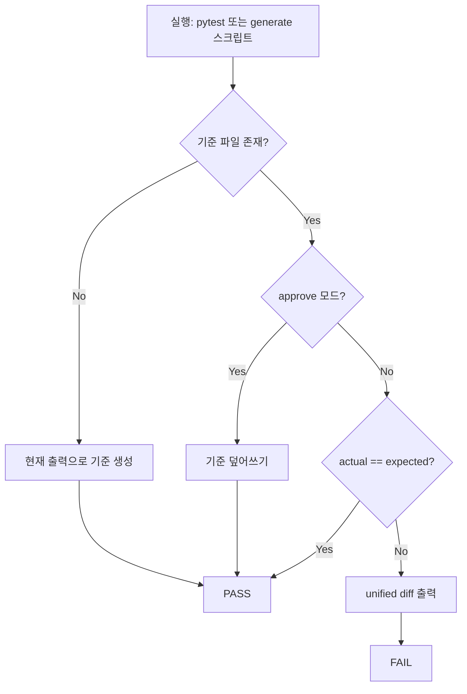

# Golden Master (Approval) 회귀 테스트 설계

| 항목 | 내용 |
|------|------|
| 대상 | MagicSquare_xx 솔버 출력 (`ScreenBoundary.submit` → `resolve`) |
| 프레임워크 | pytest |
| 기준 파일 | `tests/golden_master_expected.txt` |
| 생성 스크립트 | `scripts/generate_golden_master.py` |
| 지원 모듈 | `tests/golden_master_support.py` |
| 테스트 | `tests/test_golden_master_magic_square.py` (`@pytest.mark.golden_master`) |

---

## 1. 목적

솔버의 **성공 벡터(`int[6]`)** 와 **실패 코드(`FailureResult.code`)** 가 의도치 않게 바뀌는 회귀를 잡기 위해, 고정 입력 시나리오에 대한 전체 출력 스냅샷을 Golden Master로 관리한다.

- **캡처 대상**: `ScreenBoundary.submit(grid)` 반환값을 Result DTO 형태로 직렬화 (stdout 대신 계약 DTO 우선)
- **비교 단위**: 시나리오별 섹션을 합친 **전체 문서** 1개
- **Approve 패턴**: 기준 없으면 자동 생성, 있으면 diff 비교, 불일치 시 unified diff 후 FAIL

---

## 2. 시나리오 매트릭스

| 섹션 ID | 의도 | 입력 요약 | 기대 결과 유형 |
|---------|------|-----------|----------------|
| `GM-TC-01` | small-first 조합 즉시 성공 | 누락 `{6,15}` | `Output: [3,3,6,4,3,15]` |
| `GM-TC-02` | small-first 실패 → reverse 성공 (SC-DOM-SOL-001) | G2 fixture | `Output: [3,3,6,4,4,1]` |
| `GM-TC-03` | 빈칸 3개 (P-2 위반) | 하단 행 `0` 2개 | `Error: EMPTY_COUNT_INVALID` |
| `GM-TC-04` | 0 제외 중복 (P-4 위반) | `7` 중복 | `Error: DUPLICATE_NONZERO` |
| `GM-TC-05` | 계약 만족·해 없음 | G1 fixture | `Error: NO_VALID_COMPLETION` |

> **코드명 참고**: 요구 예시의 `INVALID_BLANK_COUNT`는 설계 문서 별칭이며, 구현 Error Contract의 실제 코드는 `EMPTY_COUNT_INVALID`이다. Golden Master는 **런타임 DTO**를 그대로 기록한다.

---

## 3. 기준 파일 구조

섹션 구분자: `________________________________________`

```
[normal_success]
Input:
16 2 3 13
5 11 10 8
9 7 0 12
4 14 0 1
Output:
[3,3,6,4,3,15]
________________________________________

[reverse_success]
...
```

### 직렬화 규칙

| 결과 | 형식 |
|------|------|
| 성공 `list[int]` | `Output:` + 줄바꿈 + `[n1,n2,...,n6]` (공백 없음) |
| 실패 `FailureResult` | `Error:` + 줄바꿈 + `{code}` (`message`는 회귀 노이즈 방지를 위해 제외) |
| 입력 격자 | `Input:` + 줄바꿈 + 행별 공백 구분 정수 |

---

## 4. Approve 패턴 흐름



### Bootstrap (기준 없음)

- `tests/golden_master_expected.txt`가 없으면 **현재 솔버 출력으로 자동 생성** 후 테스트 PASS
- CI 최초 실행·로컬 클론 직후에도 동일 동작

### Compare (기준 있음)

- `build_golden_document()` 결과와 기준 파일 전문을 **문자열 동일성**으로 비교
- 불일치 시 `difflib.unified_diff` 출력 후 `AssertionError`

### Approve (기준 갱신)

의도된 출력 변경(계약 승인) 시 아래 중 하나로 기준을 갱신한다.

```powershell
# pytest
$env:GOLDEN_MASTER_APPROVE=1
pytest -m golden_master -v

# 또는 CLI 플래그
pytest -m golden_master --approve-golden -v

# 생성 스크립트
python scripts/generate_golden_master.py --approve
```

---

## 5. 컴포넌트 책임

| 파일 | 책임 |
|------|------|
| `tests/golden_master_support.py` | 시나리오 정의, DTO 직렬화, diff, assert/approve |
| `scripts/generate_golden_master.py` | CI/로컬에서 기준 파일 생성·비교·승인 |
| `tests/test_golden_master_magic_square.py` | [TAG][GoldenMaster] 회귀 (GM-TC-01~05 + 계약 검증) |
| `tests/conftest.py` | `--approve-golden` 옵션, `approve_golden` fixture |

### 파이프라인

```
SCENARIOS grid
    → ScreenBoundary(resolve=control.solve.resolve)
    → FailureResult | list[int]
    → serialize_result()
    → golden_master_expected.txt
```

Boundary를 경유하므로 Domain 오류(`DomainError`)가 `FailureResult.code`로 매핑된 **실제 계약 출력**이 기록된다.

---

## 6. 실행 가이드

```powershell
# 회귀 검증 (기본)
pytest -m golden_master -v

# 기준 재생성 (의도된 변경 후)
python scripts/generate_golden_master.py --approve

# 기준만 비교 (갱신 없음, diff 시 exit 1)
python scripts/generate_golden_master.py
```

---

## 7. traceability

| 보호 대상 | Golden Master 섹션 |
|-----------|-------------------|
| MS-US-05 small-first 성공 | `normal_success` |
| SC-DOM-SOL-001 reverse 성공 | `reverse_success` |
| P-2 빈칸 2개 | `invalid_blank_count` |
| P-4 중복 금지 | `duplicate_number` |
| NO_VALID_COMPLETION | `no_valid_solution` |
| M-1 결정성 | 동일 입력 → 동일 섹션 문자열 |

---

## 8. 운영 규칙

1. **기준 파일은 반드시 Git에 커밋**한다 (`tests/golden_master_expected.txt`).
2. 솔버·오류 코드·출력 벡터 변경은 Golden Master diff를 **PR 아티팩트**로 검토한다.
3. Approve는 리뷰 승인 후에만 실행한다 (무분별한 `--approve` 금지).
4. AC-FR-01-01 Boundary size 검증은 별도 테스트 파일로 유지; Golden Master는 **솔버 경로**만 다룬다.
